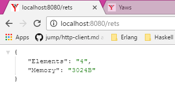

# README

* Sample REST API tutorial: http://yaws.hyber.org/appmods.yaws
* Path to ```yaws.conf```: ```C:\Program Files (x86)\Yaws-2.0.4\yaws.conf```
* To run the application "myappmod":
  * build the ```erl``` file
  * ```c(myappmod).``` having started the erlang shell in wherever the ```*.erl``` file is located.
  * drop the ```*.beam``` file here: ```C:\Program Files (x86)\Yaws-2.0.4\ebin```
* YAWS JSON: http://hyber.org/json_intro.yaws

  Sample screenshot:

  
